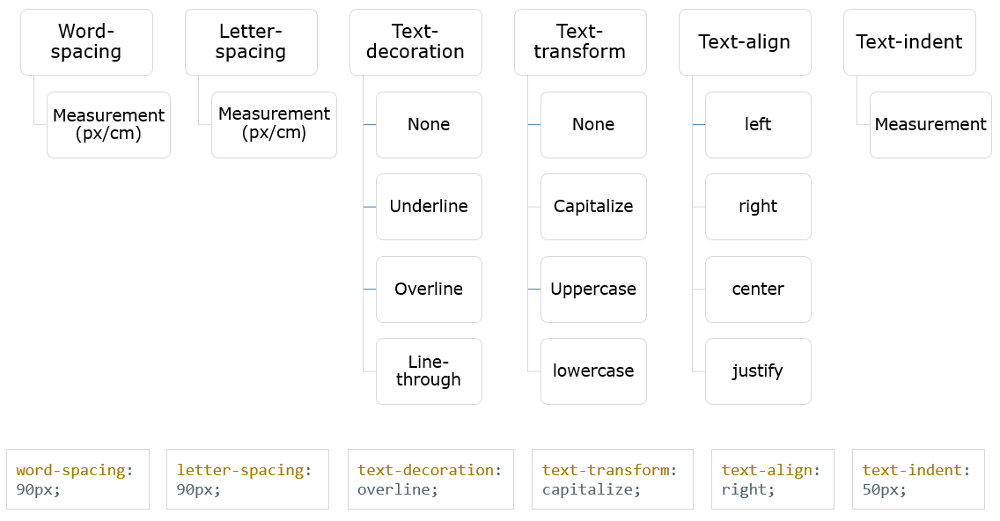
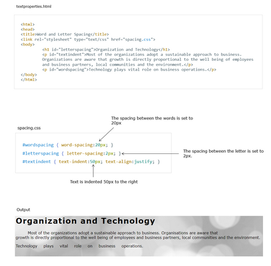

# Full CSS Course - Typography

***Typography is the way that text arranged and present***

*Let us explore on text properties in CSS.*

---

## `text-decoration` property

---

## `text-transform` property

---

## `text-align` property

---

## word-and-letter-spacing properties

---

[Google Fonts](<https://fonts.google.com/>)